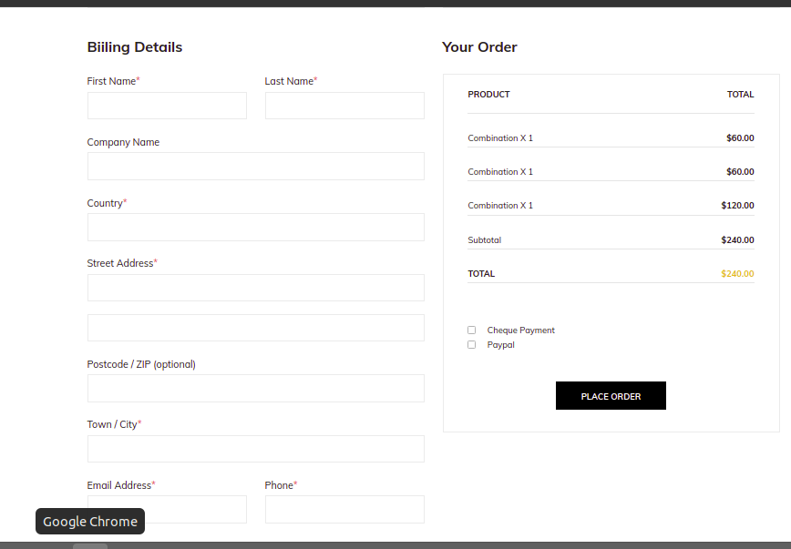

# Django_test(E-Commerce API)
Don't bother about UIs, we're here for APIs_,
Here you need to identify the schema/model fields by observing the UIs, The goal of this assignment is to build **_API_** for a **E-Commerce website** site in which you are free to play with as much as possible your sample data.

-----
-
-
-

### API Features:

1. User login for customer and seller.

- A customer can see only items.(use permission and authentication)
- A seller can upload items detail.

2. Items

- A seller can Create, Delete, Get a list of all items that he published,
- Get single item with all the reviews with ratings.( apply for seller and customer both)

3. Review

- Riview on a item.

4. Ratings

- Rating on a item.

5.create order
-A customer can create order (Hints:create api where customer post all details (e.g address, item name ,contact detail etc) 

5. Authentication 

- Login (required)
- Logout(Optional)
- Signup(Optional)

### Coding Guidelines

- Please fork current problem repository or use it as template and, add [@divyansh420](https://github.com/divyansh420),[@nitesh5695smilebots](https://github.com/nitesh5695smilebots) as collaborator while intializing repository in github. and follow the given timeline instructions from your mail.
- The changes/commits will not be considered after timeline mentioned in your mail.
- Please avoid any frameworks and libraries except **_Django REST framework_**.
- Focus more on the **_Django REST framework_** side of the problem.
- After fork do not public the repo
- You need to add requirements.txt file in project
- add  a readme.md file and add all details about your APIs.
- You will be evaluated on a **WORKING PROJECT** for:
  - Modularity of Code
  - Security
  - Data Structures used
  - Model serialization
  - Database designing
  - Logic and cleanliness of code.
  - Completeness.
- Please ask us for any hurdle in your problem assignment.

I have created a custom user model 
And implented jwt authorization for the website on this user model
and created apis accordingy with the models created from the given photography details
It took me all extra time to upload all files to git.